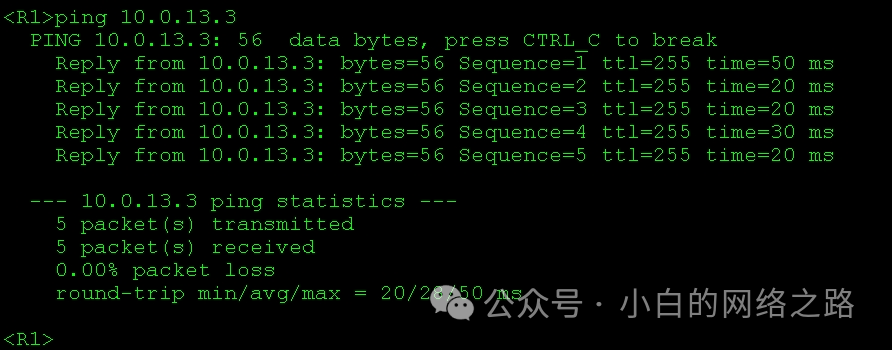
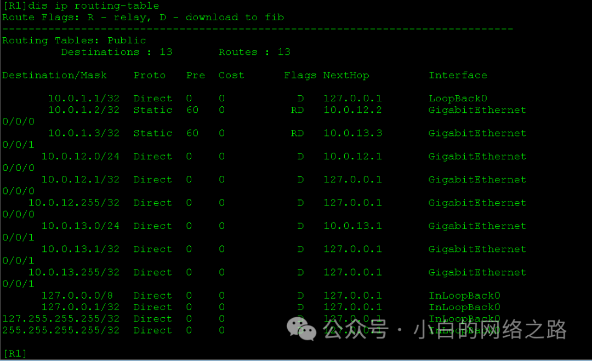

## 实验介绍:

关于本实验的所需要的知识点补充

### **IPV4知识部分：**

IPv4（Internet Protocol version 4）是互联网协议第四个版本，是目前广泛使用的IP协议的主要版本之一。IPv4使用32位地址空间，通常以点分十进制表示（例如，192.168.0.1），用于标识计算机、设备或网络在互联网中的唯一位置。

<!--truncate-->

IPv4定义了互联网上计算机之间进行数据传输的规则和格式。它提供了分组交换、分组路由和数据包传递等核心功能，通过将数据分割为小的数据包（也称为IP数据包）并在网络中传递，使得数据能够在全球范围内进行传输和交换。

IPv4地址由四个8位字段组成，每个字段的值在0到255之间。这些字段被称为IPv4地址的四个八位组或四个八位字节，例如192.168.0.1。IPv4地址的结构可以表示为“A.B.C.D”，其中A、B、C和D分别表示四个八位字段。

然而，由于IPv4只提供了有限的32位地址空间，随着互联网的发展和设备的增加，IPv4地址已经逐渐不足。为了解决这个问题，IPv6（Internet Protocol version 6）作为IPv4的继任者被开发出来，提供了128位的地址空间，以支持更多的设备连接到互联网。尽管如此，IPv4仍然广泛使用，并且在许多网络中仍然是主要的IP版本。

### **路由知识部分：**

路由是指在计算机网络中将数据包从源地址传输到目标地址的过程。它涉及将数据包从一个网络节点（或者称为路由器、交换机）转发到下一个网络节点的决策和操作。路由是网络中实现数据传输的核心机制之一。

简单来说，路由器是网络中的设备，负责根据特定的路由选择算法，根据目标地址来选择最佳路径，将数据包从源节点转发到目标节点。路由器通过查看数据包中的目标IP地址，并与路由表中的条目进行匹配，以确定下一个跳的目标地址，并将数据包转发到下一跳。这个过程可能涉及多个路由器的协作，直到数据包到达目标地址。

路由的目的是为了实现数据包的高效传输和网络资源的优化利用。通过选择最佳路径，路由可以减少数据包在网络中的传输延迟、减少网络拥塞，并确保数据包按照正确的顺序到达目标节点。

路由基于网络中的路由表来进行决策，路由表中存储了网络拓扑和路由信息。路由表可以手动配置，也可以通过路由协议（如OSPF、BGP等）自动学习和更新。路由表中的每一条目都包含目标网络的IP前缀、下一跳地址、出接口等信息，用于指导数据包的转发。

总结起来，路由是网络中将数据包从源地址传输到目标地址的过程，它通过路由器根据目标地址选择最佳路径来实现。它对于网络的性能和可靠性至关重要，并且是实现互联网通信的关键技术之一。

### **静态路由部分：**

静态路由是一种手动配置的路由方式，根据管理员预先定义的路由条目，将数据包从源地址传递到目标地址。与动态路由协议不同，静态路由不会自动学习和更新路由表，而是需要管理员手动配置和维护路由表。

在静态路由中，管理员手动配置每个目标网络的路由信息，包括目标网络的IP前缀、下一跳地址和出接口。当数据包到达路由器时，路由器会根据目标IP地址匹配静态路由表中的路由条目，并将数据包转发到指定的下一跳路由器或目标网络。

静态路由的优点是简单和可靠。它不需要协议的运行支持，不会消耗额外的网络带宽和处理能力。由于路由表是手动配置的，管理员可以精确地控制数据包的路径，并且不容易受到网络变化和故障的影响。

然而，静态路由也有一些限制和缺点。首先，静态路由不适用于大型复杂的网络环境，因为手动配置和维护路由表可能变得繁琐和容易出错。其次，静态路由缺乏动态适应网络变化的能力，当网络拓扑发生变化时，管理员需要手动更新静态路由表以适应变化。

因此，静态路由通常适用于小型网络环境或特定需求的场景，如连接几个子网或连接到其他网络的边缘路由器。在大型网络中，通常使用动态路由协议来自动学习和更新路由表，以应对复杂的网络拓扑和变化。

### **LoopBack接口**

Loopback接口是计算机网络中的一种虚拟网络接口，也被称为环回接口或本地回环接口。它是操作系统提供的一种特殊接口，用于在本地主机上进行网络通信测试和故障排除。

Loopback接口的特点是它不连接到任何物理设备或网络，而是将数据包直接发送给自身，模拟了网络通信的过程。当应用程序发送数据包到Loopback地址（通常是127.0.0.1）时，操作系统将数据包传递给Loopback接口，接口将数据包立即传递回应用程序，就像数据包通过实际网络传输后再返回一样。

Loopback接口的主要用途有：

1. 网络测试和诊断：通过将数据包发送到Loopback地址，可以测试本地网络协议的功能和性能。例如，可以通过Ping命令测试本地主机的连通性或通过发送数据包来测试特定的网络服务。
2.  本地开发和调试：在开发和调试网络应用程序时，Loopback接口可以模拟网络通信，无需实际的网络连接。这样可以方便地测试和验证应用程序的功能。
3. 安全和隔离：某些应用程序可能需要在本地主机上运行，但不希望与实际的网络进行通信。使用Loopback接口可以实现应用程序的隔离和安全，确保它们只在本地运行。

总之，Loopback接口是计算机网络中的虚拟接口，用于在本地主机上进行网络通信的测试、诊断和开发。它提供了一种方便和安全的方式来模拟网络通信，而无需实际的网络连接。

**本实验使用LoopBack接口模拟客户端。**

## **实验目的:**

1. 掌握接口 IPv4 地址的配置方法

2. 掌握静态路由的配置方法并理解其生效的条件

3. 了解loopback接口配置

   

### ***\*实验拓扑:\****


### **实验任务配置:**

**配置思路**

1. 配置路由器上各接口的 IP 地址 

2. 配置静态路由来实现互联互通

   按照下表配置路由器的接口的 IP 地址

| 路由器    | 接口         | IP地址/掩码  |
| --------- | ------------ | ------------ |
| R1        | GE0/0/0      | 10.0.12.1/24 |
| GE0/0/1   | 10.0.13.1/24 |              |
| LoopBack0 | 10.0.1.1/32  |              |
| R2        | GE0/0/0      | 10.0.12.2/24 |
| GE0/0/2   | 10.0.23.2/24 |              |
| LoopBack0 | 10.0.1.2/32  |              |
| R3        | GE0/0/1      | 10.0.13.3/24 |
| GE0/0/2   | 10.0.23.3/24 |              |
| LoopBack0 | 10.0.1.3/32  |              |

## **配置命令**

**配置IP地址方法**

**ip add 地址 掩码
**

```
<R1>system-view

[R1]interface GigabitEthernet0/0/1

[R1-GigabitEthernet0/0/1]ip address 10.0.13.1 24 

[R1-GigabitEthernet0/0/1]quit

[R1]interface GigabitEthernet0/0/0

[R1-GigabitEthernet0/0/0]ip address 10.0.12.1 24 

[R1-GigabitEthernet0/0/0]quit

[R1]interface LoopBack0

[R1-LoopBack0]ip address 10.0.0.1 32

<R2>system-view

[R2]interface GigabitEthernet0/0/0

[R2-GigabitEthernet0/0/0]ip address 10.0.12.2 24 

[R2-GigabitEthernet0/0/0]quit

[R2]interface GigabitEthernet0/0/2

[R2-GigabitEthernet0/0/2]ip address 10.0.23.2 24 

[R2-GigabitEthernet0/0/2]quit

[R2]interface LoopBack0

[R2-LoopBack0]ip address 10.0.1.2 32

<R3>system-view

[R3]interface GigabitEthernet0/0/1

[R3-GigabitEthernet0/0/1]ip address 10.0.13.3 24 

[R3-GigabitEthernet0/0/1]quit

[R3]interface GigabitEthernet0/0/2

[R3-GigabitEthernet0/0/2]ip address 10.0.23.3 24 

[R3-GigabitEthernet0/0/2]quit

[R3]interface LoopBack0

[R3-LoopBack0]ip address 10.0.1.3 32
```

### **使用 ping 工具测试联通性**




**查看 R1 的路由表**


可以看到，在接口IP地址配置完成之后，针对每个接口自动生成了三条直连路由。分别是： 指向接口所在网段的路由和指向接口IP地址的主机路由

### **配置静态路由**

**静态路由配置方法**

**ip route-static 目标网段+子网掩码+下一跳地址**

```
[R1]ip route-static 10.0.1.2 32 10.0.12.2 

[R1]ip route-static 10.0.1.3 32 10.0.13.3

[R2]ip route-static 10.0.1.1 32 10.0.12.1

[R2]ip route-static 10.0.1.3 32 10.0.23.3

[R3]ip route-static 10.0.1.1 32 10.0.13.1 

[R3]ip route-static 10.0.1.2 32 10.0.23.2
```

**测试联通性**


读者自行测试路由器的 LoopBack0 接口之间的联通性

**配置 R1->R3->R2 作为 R1 的 LoopBack0 到 R2 的 LoopBack0 接口的备份路径 # 配置 R1 和 R2 上的静态路由**

```
[R1]ip route-static 10.0.1.2 32 10.0.13.3 preference 100

[R2]ip route-static 10.0.1.1 32 10.0.23.3 preference 100
```


## **查看 R1 和 R2 上的路由表**




此时配置的 preference 为 100 的静态路由没有被加载到路由表中如果需要显示100的路由，则需要关闭接口，随着高优先级路由失效，低优先级路由被激活
