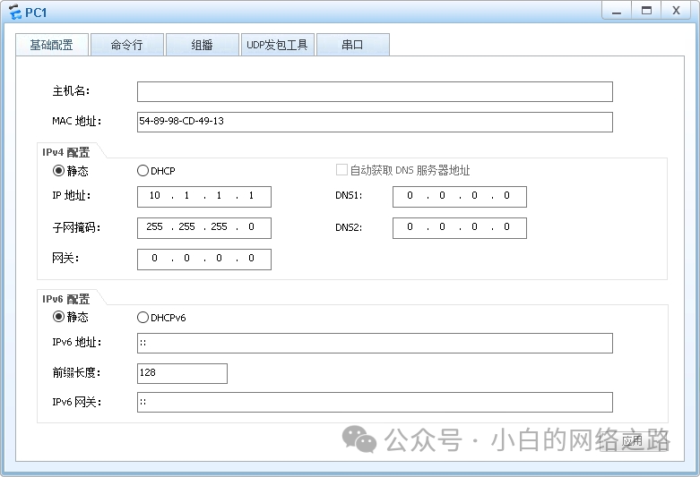
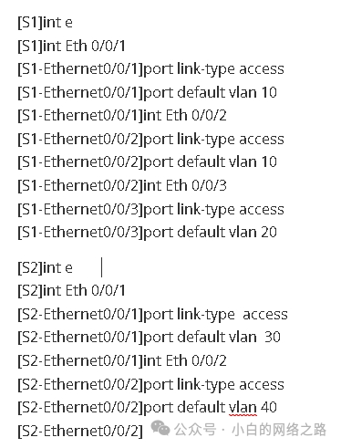
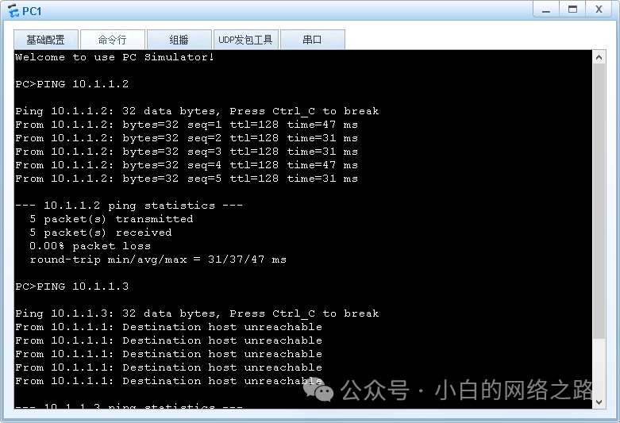

##  实验介绍:

关于本实验的所需要的知识点补充

### vlan 部分


VLAN，全称为 Virtual Local Area Network，是一种虚拟局域网技术。它通过在物理网络上进行逻辑划分，将不同的网络设备分组到不同的虚拟局域网中，实现逻辑上的隔离和独立。

<!--truncate-->

传统的局域网是基于物理连接的，所有设备都连接在同一个物理网络上。而 VLAN 技术允许管理员根据不同的需求和安全策略，将设备划分为不同的逻辑组，即虚拟局域网。这样可以实现不同虚拟局域网之间的隔离，提高网络的可管理性和安全性。

VLAN 可以通过端口、MAC 地址、IP 地址等方式进行划分和管理。在同一个物理网络中，不同的 VLAN 之间可以进行通信或隔离，类似于拆分出了多个独立的逻辑网络。这样可以实现更好的网络资源管理、提高带宽利用率、提供更精细的访问控制和安全策略等。

VLAN 技术广泛应用于企业、机构、数据中心等网络环境中，能够提供更灵活、安全和高效的网络划分和管理。

VLAN ID（VLAN 标识符）是用于识别和区分不同 VLAN 的数字标识。每个 VLAN 都被分配一个唯一的 VLAN ID，用于在网络设备之间进行识别和通信。

VLAN ID 是一个 12 位的数字，范围从 1 到 4094。其中，VLAN ID 1 和 VLAN ID 4095 有特殊用途，不能用于常规的用户数据流量。通常，管理员根据网络需求和设计，为不同的 VLAN 分配不同的 VLAN ID。

在网络设备（如交换机）的配置中，将每个端口或接口与特定的 VLAN 关联起来，以确定哪些设备属于哪个 VLAN。当数据包进入交换机时，根据数据包的 VLAN ID 来决定将其发送到哪个 VLAN 中的设备。

VLAN ID 在实现虚拟局域网时起到了关键的作用，它允许网络管理员轻松地将设备划分到不同的逻辑网络中，并为每个 VLAN 提供独立的网络环境和服务。通过使用 VLAN ID，不同 VLAN 之间的数据可以在同一物理网络上进行隔离和转发，提供更高的网络灵活性和管理能力。


### access 部分


Access 接口是指网络设备（如交换机）上用于连接终端设备的端口或接口。它是用于连接终端设备（如计算机、IP 电话、摄像头等）到网络的物理接口。

在一个交换机上，通常有多个接口，其中一部分被配置为 Access 接口。Access 接口只能属于一个 VLAN，并且只能传输属于该 VLAN 的数据。终端设备连接到 Access 接口时，数据包会被标记上该接口所属的 VLAN ID，交换机会根据这个标记将数据包发送到相应的 VLAN。Access 接口通常连接到终端设备或其他不需要 VLAN 划分的设备。

通过使用 Access 接口，可以实现对不同终端设备的统一管理和控制。可以为每个 Access 接口配置所属的 VLAN，从而实现终端设备的逻辑划分和隔离。这样可以提高网络的安全性、灵活性和可管理性。
### 实验目的

- 理解 vlan 的应用场景和基本配置
- 掌握 access 接口的配置和加入相对应的 vlan 的方法

### 实验背景 

本实验模拟企业网络场景。公司内网是一个大的局域网，二层交换机 S1 放置在一楼，在一楼办公的部门有 IT 部和人事部;二层交换机 S2 放置在二楼，在二楼办公的部门有市场部和研发部。由于交换机组成的是一个广播网，交换机连接的所有主机都能互相通信，而公司策略是:不同部门之间的主机不能互相通信，同一部门内的主机才可以互相访问。因此需要在交换机上划分不同的 VLAN，并将连接主机的交换机接口配置成 Access 接口划分到相应 VLAN 内。

### 实验拓扑 


## 实验任务配置 

### IP 地址规划

| 设备 | 接口   | IP地址/掩码 | 所属vlan |
| ---- | ------ | ----------- | -------- |
| PC1  | E0/0/1 | 10.1.1.1/24 | 10       |
| PC2  | E0/0/1 | 10.1.1.2/24 | 10       |
| PC3  | E0/0/1 | 10.1.1.3/24 | 20       |
| PC4  | E0/0/1 | 10.1.1.4/24 | 30       |
| PC5  | E0/0/1 | 10.1.1.5/24 | 40       |

### 基本配置


其他主机间互相通信测试和上述相同，略过。
### 创建 vlan
系统默认分配 vlan1给所有端口，您需要手动新建VLAN。

- 使⽤vlan [id]命令创建。

- 使用 vlan batch [id] 批量创建。


```
[S1]vl 10#或者，您可以使用batch命令一次创建多个VLAN
[S1]vlan b 20 30 40 #此处的 batch 可以缩写成 b
```


配置完成后可以使用 `display vlan` 查看 vlan 信息


### 配置 access 接口
连接 PC（终端）的接口必须为 `access` 类型接口。并使用 `port default vlan` 命令来加入相应的 vlan 中。
默认情况下，所有接口默认是 `vlan 1`



### 配置完成后可以查看 S1 和 S2 上的 vlan 信息


## 检查配置结果




在交换机上将不同接口加入各自不同的 VLAN 中后，属于相同 VLAN 的接口处于同一个广播域，相互之间可以直接通信。属于不同 VLAN 的接口是处于不同的广播域，相互之间不能直接通信。