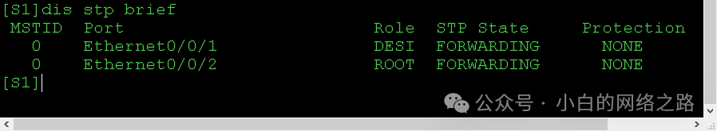

## 实验介绍

### 什么是STP？

STP（Spanning Tree Protocol）是一种用于防止网络中出现环路的协议。在局域网中，当存在多个交换机连接时，可能会形成环路，导致数据包在网络中无限循环，从而引发网络拥塞和广播风暴。

<!--truncate-->

STP 协议通过在网络中选择一个主交换机（Root Bridge），并在其它交换机之间建立一颗无环的树状拓扑结构，来解决环路问题。该树状拓扑中的路径称为"最短路径树"（Spanning Tree），其中只有一个路径可用，其它路径被阻塞。

STP 协议的工作原理是通过交换机之间的 BPDU（Bridge Protocol Data Units）消息进行交互，进行根桥的选举和端口状态的协商。BPDU 消息包含了交换机的标识、优先级等信息，通过比较这些信息来确定根桥和最短路径。

当网络中有新的交换机加入或旧的交换机离开时，STP 会重新计算最短路径树，以适应网络的变化。它会通过阻塞或开放某些端口，确保网络中没有环路，并提供冗余路径以提高网络的可靠性。

STP 协议有多个版本，如经典的 STP（IEEE 802.1D）、快速 STP（Rapid Spanning Tree Protocol，RSTP，IEEE 802.1w）和多实例 STP（Multiple Spanning Tree Protocol，MSTP，IEEE 802.1s）。这些版本在性能和功能上有所区别，但都是为了解决网络中的环路问题。

STP（Spanning Tree Protocol）协议中常用的端口包括以下几种：

> 1. Root Port（根端口）：根端口是指连接到最短路径树上的最短路径的端口。在每个非根交换机上，与根桥之间的连接上具有最小路径代价的端口会被选为根端口。每个桥/交换机只能有一个根端口。
>
>    
>
> 2. Designated Port（指定端口）：指定端口是指连接到特定网段上的端口。在每个网段上，与根桥之间的连接上具有最小路径代价的端口会被选为指定端口。每个网段只能有一个指定端口。
>
>    
>
> 3. Non-Designated Port（非指定端口）：非指定端口是指除了根端口和指定端口之外的所有端口。非指定端口会被阻塞，以确保网络中没有环路。当有多个非指定端口连接到同一个交换机时，其中代价最大的端口会被阻塞。
>
>    

这些端口状态是 STP 协议运行时根据交换机之间的链路状态和路径代价进行计算和选择的。通过根端口和指定端口，STP 协议构建了一棵无环的最短路径树，以确保数据在网络中能够正确地转发和到达目的地。非指定端口则起到了阻塞的作用，以避免环路的产生。

### 实验目的

- 理解STP 的选举过程
- 掌握修改交换机优先级的方法

### 实验内容/模拟场景

公司购置了4台交换机，组建网络。考虑到网络的可靠性，将4台交换机如图所示拓扑搭建。由于默认情况下，交换机之间运行STP后，根交换机、根端口、指定端口的选择将基于交换机的MAC地址的大小，因此带来了不确定性，极可能由此产生隐患。公司网络规划，需要 `S1`作为主根交换机，`S2`作为`S1`的备份根交换机。

### 实验拓扑


## 配置环节

根据拓扑图，在交换机上启用STP(华为交换机默认启用MSTP)将交换机的STP模式更改为普通生成树STP。

~~~
[S1]stp enable

[S1]stp mode stp

[S2]stp enable

[S2]stp mode stp

[S3]stp enable

[S3]stp mode stp

[S4]stp enable

[S4]stp mode stp
~~~

配置完成后，默认情况下需要等待30s生成树重新计算的时间(15s Forward Delay加上15s Learning 状态时间)，再使用`display stp`命令查看`S1`的生成树状态。

```
display stp
```


还可以使用`display stp brief`命令`S1`、`S2`、`S3`、`S4` 上仅查看摘要信息

```
display stp brief
```




在交换机`S3`上所有的端口角色都为指定端口，且端口状态都为转发。

可以初步判断4台交换机中`S3`为根交换机，因为该交换机所有端口都为指定端口。

生成树运算第一步就是通过比较每台交换机的ID选举根交换机。交换机ID由交换机优先级和 MAC 地址组成，首先比较交换机优先级数值最低的为根交换机;如果优先级一样，则比较MAC地址，同样数值最低的选举为根交换机。

### 配置网络中的根交换机

根交换机在网络中的位置是非常重要的，如果选择了一台性能较差的交换机，或者是部署在接入层的交换机作为根交换机，会影响到整个网络的通信质量及数据传输。所以确定根交换机的位置极为重要。根交换机选举依据是根交换机 ID，值越小越优先，交换机默认的优先级为 `32768`，当然该值是可以修改的。

现在将`S1`配置为主根交换机，`S2`为备份根交换机，将`S2`的优先级改为0，`S1`的优先级改为`4096`。

```
[S1]stp priority 0

[S2]stp priority 4096
```

配置完成后查看`S1`和`S2`的STP状态信息。


