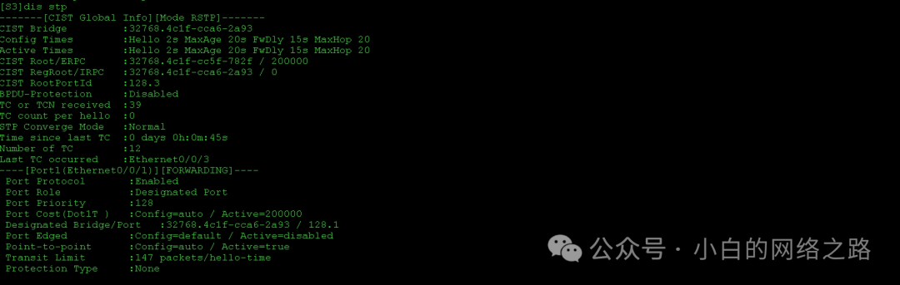
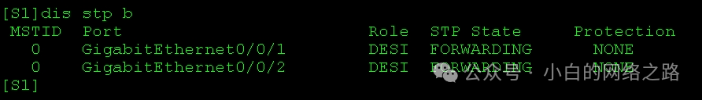

## 实验介绍

**RSTP**

RSTP（Rapid Spanning Tree Protocol）是一种快速生成和收敛的二层网络冗余协议，是 IEEE 802.1w 标准定义的一种 Spanning Tree Protocol（STP）的改进版本。

<!--truncate-->

RSTP 的主要目标是提供更快的收敛时间，以便在网络发生拓扑变化时更快地恢复和重新计算最短路径树。相比传统的 STP 协议，RSTP 的收敛时间更短，网络恢复更迅速。

以下是 RSTP 的一些关键特点：

> 1. 端口状态：RSTP 引入了三个新的端口状态：指定端口（Designated Port）、根端口（Root Port）和备份端口（Alternate Port），以提高网络冗余和故障恢复能力。
> 2. 快速收敛：RSTP 使用了一些机制来加速网络的收敛，例如：端口状态转换的快速学习、边缘端口（Edge Port）的立即转换以及处理拓扑变化的快速通告等。
> 3. 互操作性：RSTP 与传统的 STP 协议具有向后兼容性，因此可以与使用 STP 的设备进行互操作。
> 4. 端口类型：RSTP 引入了两种新的端口类型：边缘端口和点对点端口，以减少拓扑变化对整个网络造成的影响。
> 5. 拓扑变化检测：RSTP 通过发送和接收 BPDU（Bridge Protocol Data Unit）来检测网络拓扑的变化，并相应地进行端口状态的更新和拓扑重计算。

总的来说，RSTP 通过引入新的端口状态、采用快速收敛机制和改进的拓扑变化检测等方法，提供了更快的网络收敛时间和更高的冗余容错能力。这样可以确保网络的高可用性和稳定性，并减少对网络服务的中断时间。

**RSTP的端口状态**

RSTP（Rapid Spanning Tree Protocol）引入了不同于传统 STP（Spanning Tree Protocol）的端口状态，以提高网络的收敛速度和冗余能力。以下是 RSTP 中的端口状态：

> 1. 指定端口（Designated Port）：在每个网络段中，RSTP 选举出一个指定端口作为主要的转发端口，用于转发数据帧。指定端口是活动的，并且可以传输数据。
> 2. 根端口（Root Port）：根端口是一种特殊的指定端口，用于连接到树的根桥。每个非根桥都会选择一条到达树的根桥的最短路径，并将该路径上的端口设置为根端口。
> 3. 备份端口（Alternate Port）：备份端口是处于阻塞状态的端口，它备份着另一个指定端口，以提供冗余连接。当指定端口发生故障或失效时，备份端口会接管其功能，以确保网络的连通性。
> 4. 边缘端口（Edge Port）：边缘端口是连接到主机或终端设备的非冗余端口。这些端口可以立即进入指定状态，而无需等待 STP 收敛的过程。边缘端口在启动时不发送 BPDU（Bridge Protocol Data Unit）。
> 5. 点对点端口（Point-to-Point Port）：点对点端口是直接连接到另一个网桥的端口。这些端口可以更快地收敛，因为它们不需要进行额外的 BPDU 交换。

这些端口状态的引入使 RSTP 能够更快地收敛，并提供更高的冗余容错能力。通过快速决策和转变端口状态，RSTP 可以更迅速地适应网络拓扑变化，减少网络中断和数据包丢失的时间。

### 实验目的

- 理解RSTP 的应用场景
- 掌握RSTP 的基本配置
- 掌握RSTP 的边缘端口的应用
- 理解RSTP 备份端口

### 模拟环境

本实验模拟公司网络场景。`S3`和`S4`是接入层交换机，负责用户的接入，`S1`和`S2`是汇聚层交换机，四台交换机组成一个环形网络。为了防止网络中出现环路，产生网络风暴，所有交换机上都需要运行生成树协议。同时为了加快网络收敛速度，网络管理员选择使用`RSTP`协议，且使得性能较好的`S1`为根交换机，`S2`为次根交换机，并配置边缘端口进一步优化公司网络。

### 实验拓扑


## 实验配置

### 测试连通性


### 配置RSTP基本功能

在汇聚层交换机`S1`、`S2`及接入层交换机`S3`、`S4`上，把生成树模式由默认的`MSTP`改为`RSTP`。由于华为交换机上默认即开启了`MSTP`，故只需修改生成树模式即可。

~~~
[S1]stp mode rstp

[S2]stp mode rstp

[S3]stp mode rstp

[S4]stp mode rstp
~~~

配置完成后，在交换机`S1`、`S2`、`S3`和`S4`上都使用`display stp`命令去查看生成树的模式及根交换机的位置。

~~~
display stp
~~~





上述信息中，**CIST Bridge** 是交换机自己的ID，而**CISTRoot**是根交换机的ID。根交换机是交换机ID最小的交换机，所以，观察可知，`S4`是当前的根交换机。

在RSTP构建的树形拓扑中，网络管理员需要设置汇聚层主交换机`S1`为根交换机，汇聚层交换机`S2`为备份根交换机。

~~~
[S1]stp root primary

[S2]stp root secondary
~~~

配置完成后，同样在`S1` 上使用`display stp`命令观察。


可以观察到，`stp root primary` 命令修改的是交换机ID 中的交换机优先级，把默认的优先级由`32768` 改为0，所以`S1`的交换机ID 变为最小，是**Primary root**，即根交换机

同样在`S2` 上使用`display stp`命令观察。


可以观察到，`stprootsecondary` 命令修改的也是交换机ID 中的交换机优先级，把默认的优先级由`32768` 改为`4096`，使`S2` 的桥ID 变为次小，是**Secondaryroot**，即次根交换机。

继续使用`display stp brief` 命令查看每台交换机上的端口角色及状态。

```
display stp brief
```





### 配置边缘端口

生成树的计算主要发生在交换机互连的链路之上，而连接 PC的端口没有必要参与生成树计算，为了优化网络，降低生成树计算对终端设备的影响，现在网络管理员把交换机上连接PC的接口配置为边缘端口。

```
[S4]interface Ethernet0/0/1

[S4-Ethernet0/0/1]stp edged-port enable

[S3]interface Ethernet0/0/1

[S3-Ethernet0/0/1]stp edged-port enable
```

配置S4上连接PC的端口为边缘端口，此时生成树计算工作依然进行，但端口进入转发状态无需等待30s。


可以观察到，接口立刻进入到`Forwarding`状态，没有30s的延迟。在使用`RSTP`的环境中，可以在交换机上把连接PC、路由器和防火墙的端口都配置为边缘端口，边缘端口能降低终端设备访问网络需要等待的时间，明显提高网络的可用性。

## End.