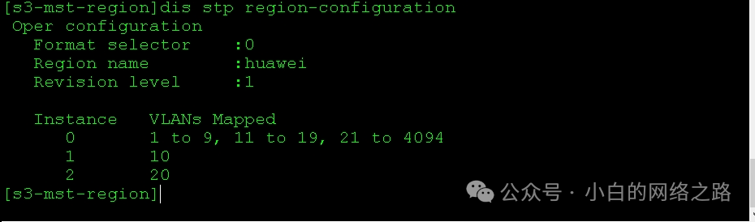

## 实验介绍

**MSTP**

MSTP（Multiple Spanning Tree Protocol）是一种基于 IEEE 802.1Q 标准的 Spanning Tree Protocol（STP）的扩展协议。MSTP 允许网络管理员将网络划分为多个实例，每个实例都可以拥有独立的生成树，以提高网络的容错性和利用率。

<!--truncate-->

MSTP 的主要特点包括：

1. 实例化：MSTP 将网络划分为多个实例，每个实例都有一个唯一的实例标识（Instance ID），并可以配置不同的生成树参数。这使得网络管理员可以根据网络的需求和拓扑结构来定制化生成树的计算和转发规则。
2. 区域化：MSTP 支持将网络划分为多个区域，每个区域内可以使用不同的 MSTP 实例。不同的区域之间通过特殊的边界桥（Boundary Bridge）进行连接，边界桥负责转发跨区域的数据。
3. 实例间的互斥：MSTP 确保不同实例之间的生成树是互斥的，这意味着每个实例的生成树都是独立计算的，互不干扰。这样可以实现更细粒度的故障隔离和负载均衡。
4. 兼容性：MSTP 是 STP 的扩展，与 STP 和 RSTP 兼容。它可以与使用 STP 或 RSTP 的设备进行互操作，而不会引入不兼容性问题。

MSTP 的引入解决了传统 STP 在大型网络中的一些问题，如生成树计算的复杂性和资源浪费。通过引入实例化和区域化的概念，MSTP 提供了更高效、灵活和可扩展的生成树协议。

**MSTP的端口状态**

在 MSTP（Multiple Spanning Tree Protocol）中，端口可以具有以下几种不同的状态：

1. Disabled（禁用）：禁用状态表示端口未参与生成树协议，不进行任何生成树计算和数据转发。禁用状态的端口不会发送或接收任何生成树协议的消息。
2. Blocking（阻塞）：阻塞状态是端口在生成树协议中的初始状态。在阻塞状态下，端口仍然能够接收生成树协议消息，但不会进行数据转发。阻塞状态的目的是防止环路的形成，并在生成树计算中确定生成树的路径。
3. Listening（监听）：监听状态是端口在从阻塞状态切换到学习状态之前的过渡状态。在监听状态下，端口仍然能够接收生成树协议消息，并开始学习 MAC 地址。但是，端口仍然不会进行数据转发。
4. Learning（学习）：学习状态是端口在从监听状态切换到转发状态之前的过渡状态。在学习状态下，端口仍然能够接收生成树协议消息，并继续学习 MAC 地址。此时，端口开始建立 MAC 地址表，但仍然不会进行数据转发。
5. Forwarding（转发）：转发状态是端口在生成树计算完成后的最终状态。在转发状态下，端口能够接收生成树协议消息，并将数据帧转发到相应的端口。转发状态的端口是活动的，可以进行数据转发。

这些端口状态的转换是由生成树协议自动进行的，以确保网络中没有环路并提供最佳路径。通过根据网络拓扑和生成树计算来改变端口的状态，MSTP 实现了冗余路径的选择和故障恢复。

### 实验目的

- 掌握MSTP 的基础配置
- 掌握配置MSTP 多实例的方法

### 模拟环境

某公司二层网络由三台交换机S1、S2、S3组成。交换机S1与S2在一个楼层，S3在另一楼层。PC-1与PC-2属于HR部门，划入VLAN10，PC-3与PC-4 属于IT 部门，划入VLAN20。当使用普通STP时，STP 将会阻塞一条链路来防止环路产生，导致该链路闲置。为了保证所有链路都能充分利用，使流量能够分担，网络管理员通过配置MSTP来实现。

### 实验拓扑


### 实验编址

| 设备 | 接口   | 地址/掩码       | 所属vlan |
| ---- | ------ | --------------- | -------- |
| PC1  | E0/0/1 | 192.168.10.1/24 | VLAN10   |
| PC2  | E0/0/1 | 192.168.10.2/24 | VLAN10   |
| PC3  | E0/0/1 | 192.168.20.1/24 | VLAN20   |
| PC4  | E0/0/1 | 192.168.20.2/24 | VLAN20   |

## 实验配置

### 基本配置


其他主机间互相通信测试和上述相同

### 配置VLAN

#### SW1

```
[S1]vlan batch 10 20

[S1]interface Ethernet0/0/3

[S1-Ethernet0/0/3]port link-type access

[S1-Ethernet0/0/3]port default vlan 10

[S1-Ethernet0/0/3]interface Ethernet0/0/1

[S1-Ethernet0/0/1]port link-type trunk

[S1-Ethernet0/0/1]port trunk allow-pass vlan all

[S1-Ethernet0/0/1]interface Ethernet0/0/2

[S1-Ethernet0/0/2]port trunk allow-pass vlan all
```

#### SW2

```
[S2]vlan batch 10 20

[S2]interface Ethernet0/0/3

[S2-Ethernet0/0/3]port link-type access

[S2-Ethernet0/0/3]port default vlan 20

[S2-Ethernet0/0/3]interface Ethernet0/0/2

[S2-Ethernet0/0/2]port link-type trunk

[S2-Ethernet0/0/2]port trunk allow-pass vlan all

[S2-Ethernet0/0/2]interface Ethernet0/0/1

[S2-Ethernet0/0/1]port link-type trunk

[S2-Ethernet0/0/1]port trunk allow-pass vlan all
```

#### SW3

```
[S3]vlan batch 10 20

[S3]interface Ethernet0/0/3

[S3-Ethernet0/0/3]port link-type access

[S3-Ethernet0/0/3]port default vlan 10

[S3-Ethernet0/0/3]interface Ethernet0/0/4

[S3-Ethernet0/0/4]port link-type access

[S3-Ethernet0/0/4]port default vlan 20

[S3-Ethernet0/0/4]interface Eth0/0/1

[S3-Ethernet0/0/1]port link-type trunk

[S3-Ethernet0/0/1]port trunk allow-pass vlan all

[S3-Ethernet0/0/1]interface Ethernet0/0/2

[S3-Ethernet0/0/2]port link-type trunk

[S3-Ethernet0/0/2]port trunk allow-pass vlan all
```

当网络管理员按照设计搭建完公司二层网络后，启动设备。在华为交换机上默认即运行`MSTP`协议。

在`S1` 上使用`display stp`命令查看生成树的状态和统计信息。

```
display stp
```


可以观察到，在`CIST`全局信息中，显示目前`STP`模式为`MSTP`，根交换机为`S1`自身，另外还有交换机各个接口上的`STP`信息。使用`display stp brief `命令查看`S1`、`S2`、`S3` 上生成树的状态和统计的摘要信息。

```
display stp brief
```


可以观察到，此时 `S1`上的端口都为指定端口，且都处于转发状态，为根交换机。`S2`上的`E0/0/1`为替代端口，处于丢弃状态。

### 配置MSTP多实例

`MSTP`网络由一个或者多个`MST`域组成，每个`MST`域中可以包含一个或多个`MSTI`，即`MST`实例。`MST`域中含有一张`VLAN`映射表，描述了`VLAN`与`MSTI`之间的映射关系，默认情况下所有`VLAN`都映射到`MSTI0` 中。`MSTI`之间彼此独立。

在 `S1` 上配置 `MSTP` 的多实例。使用 `stp region-configuration` 命令进入 `MST` 域视图。

```
[S1]stp region-configuration

[S1-mst-region]
```

使用`region-name`命令配置`MST`域名为`huawei`。

```
[S1-mst-region]region-name huawei
```

使用`revision-level`命令配置`MSTP`的修订级别为`1`。

```
[S1-mst-region]revision-level 1
```

使用`instance` 命令指定`VLAN10`映射到`MSTI1`，指定`VLAN20`映射到`MSTI 2`。

```
[S1-mst-region]instance 1 vlan 10

[S1-mst-region]instance 2 vlan 20
```

使用`active region-configuration`命令激活`MST` 域配置。

```
[S1-mst-region]active region-configuration
```

在`S2`、`S3`上做同样配置，但是注意，在同一`MST`域中，必须具有相同域名、修订级别以及`VLAN`到`MSTI`的映射关系。

#### SW2

```
[S2]stp region-configuration

[S2-mst-region]region-name huawei

[S2-mst-region]revision-level 1

[S2-mst-region]instance 1 vlan 10

[S2-mst-region]instance 2 vlan 20

[S2-mst-region]active region-configuration
```

#### SW3

```
[S3]stp region-configuration

[S3-mst-region]region-name huawei

[S3-mst-region]revision-level 1

[S3-mst-region]instance 1 vlan 10

[S3-mst-region]instance 2 vlan 20

[S3-mst-region]active region-configuration
```

配置完成后，在`S1`、`S2`、`S3`上使用`display stp region-configuration`命令查看交换机上当前生效的`MST`域配置信息。

```
display stp region-configuration
```




可以观察到，所有交换机上的 `MST`域名都为 `huawei`，修订版本号都为 `1`，且`VLAN` 与实例间的映射关系相同，其中除 `VLAN 10` 与`20`之外，其余 `VLAN` 都属于实例`0`中。

## END.