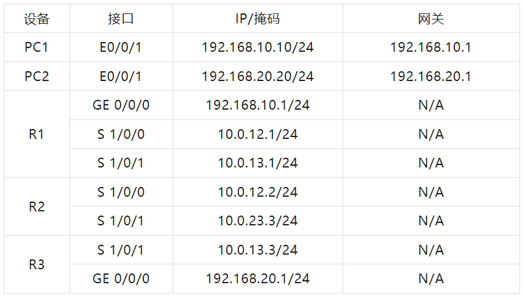
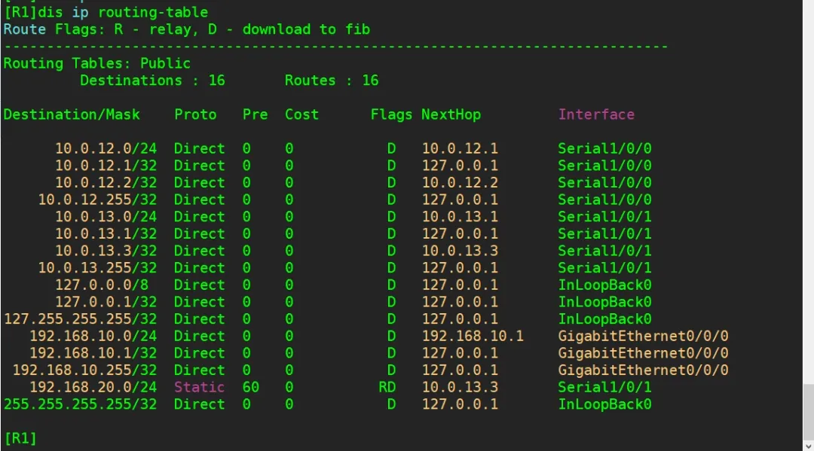
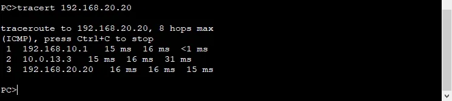
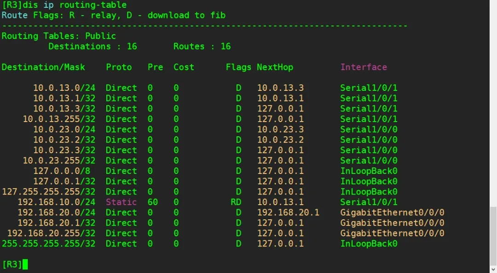
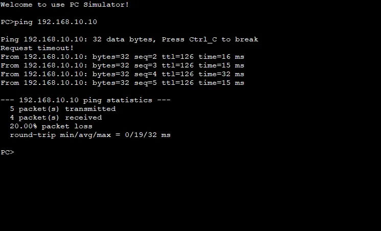
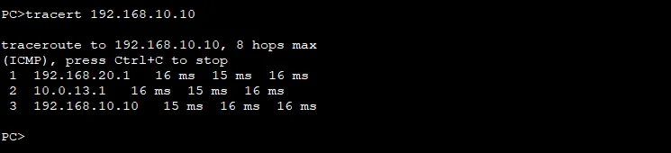
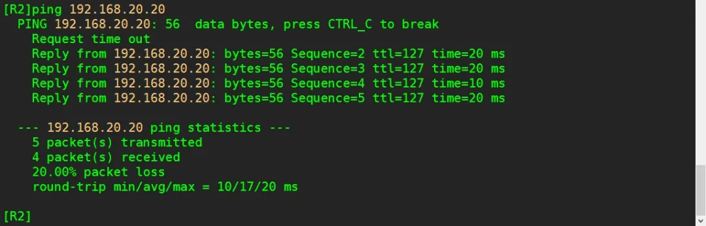
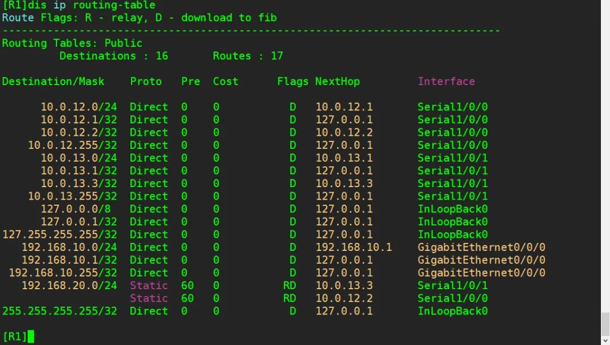

## 实验介绍

### 浮动路由与静态路由

浮动静态路由(Floating Static Route)是一种特殊的静态路由，通过配置去往相同的目的网段，但优先级不同的静态路由，以保证在网络中优先级较高的路由，即主路由失效的情况下，提供备份路由。正常情况下，备份路由不会出现在路由表中。

负载均衡(Load sharing)，当数据有多条可选路径前往同一目的网络，可以通过配置相同优先级和开销的静态路由实现负载均衡，使得数据的传输均衡地分配到多条路径上，从而实现数据分流、减轻单条路径负载过重的效果。

而当其中某一条路径失效时，其他路径仍然能够正常传输数据，也起到了冗余作用。

<!--truncate-->

### 实验目的

- 理解浮动静态路由的应用场景
- 掌握配置浮动静态路由的方法
- 掌握测试浮动静态路由的方法
- 掌握配置静态路由负载均衡的方法
- 掌握测试静态路由负载均衡的方法

### 实验内容

R2为某公司总部，R1与R3是两个分部，主机PC-1与PC-2所在的网段分别模拟两个分部中的办公网络。现需要总部与各个分部、分部与分部之间都能够通信。

且分部之间在通信时，之间的直连链路为主用链路，通过总部的链路为备用链路。本实验使用浮动静态路由实现需求，并再根据实际需求实现负载均衡来优化网络。

### 实验拓扑


### 实验编址



## 实验配置

### 基本配置

```
[R1]int g0/0/0
[R1-GigabitEthernet0/0/0]ip add 192.168.10.1 24
[R1]int s1/0/0
[R1-Serial1/0/1]ip add 10.0.12.1 24
[R1]int s1/0/1
[R1-Serial1/0/1]ip add 10.0.13.1 24

[R2]int s1/0/0
[R2-Serial1/0/1]ip add 10.0.12.2 24
[R2]int s1/0/1
[R2-Serial1/0/1]ip add 10.0.23.2 24

[R3]int g0/0/0
[R3-GigabitEthernet0/0/0]ip add 192.168.20.1 24
[R3]int s1/0/0
[R3-Serial1/0/1]ip add 10.0.23.3 24
[R3]int s1/0/1
[R3-Serial1/0/1]ip add 10.0.13.3 24
```

#### 实现分部、总部与分部部之间的通信

在R1上配置目的网段为主机PC-2所在网段的静态路由，在R3上配置目的网段为主机PC-1所在网段的静态路由，在R2上配置目的网段分别为主机PC-1和PC-2所在网段的静态路由。

```
[R1]ip route-static 192.168.20.0 24 10.0.13.3

[R2]ip route-static 192.168.20.0 24 10.0.23.3
[R2]ip route-static 192.168.10.0 24 10.0.12.1

[R3]ip route-static 192.168.10.0 24 10.0.13.1
```

配置完成后，在R1上查看路由表。

```
[R1]display ip routing-table
```



可以观察到，在R1的路由表中存在以主机PC-2所在网段为目的网段的路由条目，且下一跳路由器为R3。测试主机PC-1与主机PC-2之间的连通性。


通信正常，这时可以通过在主机PC-1上使用tracert命令测试所经过的网关。



通过观察发现数据包是经过R1和R3到达主机PC-2的。

同样在主机PC-2和R3上进行查看，首先在R3上查看路由表。





可以观察到通信正常。在主机PC-2上测试访问主机PC-1所经过的网关。



可以验证数据包是经过R3和R1到达主机PC-1的。

在总部路由器R2上测试与分部的连通性。




通过测试，总部路由器R2能够正常访问两个分部主机PC-1和主机PC-2的网络。

#### 配置浮动静态路由实现路由备份

通过上一步骤的配置，现在网络搭建已经初步完成。现需要实现当两分部间通信时，直连链路为主用链路，通过总部的链路为备用链路，即当主用链路发生故障时，可以使用备用链路保障两分部网络间的通信。这里使用浮动静态路由实现网络冗余。

在R1上配置静态路由，目的网段为主机PC-2所在网段，掩码为24位，下一跳为R2，将路由优先级设置为100(默认是60)中

```
[R1]ip route-static 192.168.20.0 24 10.0.12.2 preference 100
```

配置完成后，查看路由器R1的路由表。


可以观察到目的地址为PC-2所在网段的两条优先级为100和60的静态路由条目都已经存在。

现在 R1 上去往相同的目的网段存在有两条不同路由条目，首先会比较它们的优先级，优先级高的，即对应的优先级数值较小的路由条目将被选为主用路由。通过比较，优先级数值为60的条目优先级更高，将被R1使用，放入路由表中，状态为Active;而另一条路由状态则为 Inactive，作为备份，不会被放入路由表。只有当Active 的路由条目失效时，优先级为100的路由条目才会被放入路由表。

在R3上做和R1同样的对称配置。

```
[R3]ip route-static 192.168.10.0 24 10.0.23.2 preference 100
```

接下来，将路由器R1的S 1/0/1接口关闭，验证使用备份链路。

```
[R1]interface serial 1/0/1
[R1-Serial1/0/1]shutdown
```

配置完成后，查看路由器R1的路由表，并使用displayiprouting-table protocol static命令查看。


可以观察到，此时优先级为100的路由条目已经添加到路由表中。


可以观察到，现在优先级为100的条目为Active状态，优先级为60的条目为Inactiye状态。

测试主机PC-1与PC-2间的通信。


通信正常，再使用tacert命令查看此时PC-1与PC-2通信时所经过的网关。


再次验证了此时两分部之间通信时已经使用了备用链路。

####  通过负载均衡实现网络优化

公司网络管理员发现分部之间业务往来越来越多，网络流量剧增，主用链路压力非常大，而总部与两分部间的网络流量相对较少，即备用链路上的带宽多处在闲置状态。此时可以通过配置实现负载均衡，即同时利用主备两条链路来支撑两分部间的通信。

恢复R1 上的S 1/0/1 接口，并配置目的网段为主机PC-2所在网段掩码为24 位，下一跳为R2，优先级不变。

```
[R1]interface serial 1/0/1[R1-Serial1/0/1]undo shutdown[R1-Serial1/0/1]ip route-static 192.168.20.0 24 10.0.12.2
```

使用display ip routing-table 命令查看R1 上的路由表。

```
[R1]display ip routing-table
```



配置完成后，可以观察到现在去往 192.168.20.0网段拥有两条下-跳不同的路由条目，即实现了负载均衡。测试主机PC-1与PC-2间的通信。


可以观察到，通信正常。

在R3上做和R1同样的对称配置。

```
[R3]ip route-static 192.168.10.0 24 10.0.23.2
```

配置完成后，能够在R3的路由表中观察到与R1路由表相同的情况。


通过配置针对相同目的地址但优先级值不同的静态路由，可以在路由器上实现路径备份的功能。而通过配置针对相同目的地址且优先级值相同的静态路由，不仅互为备份还能实现负载均衡。

## END