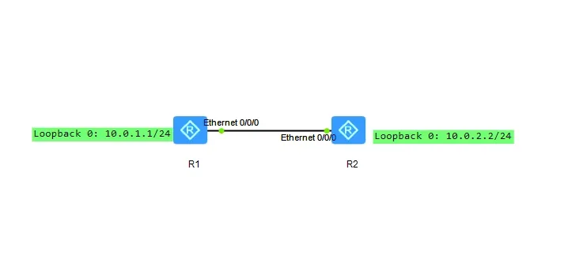
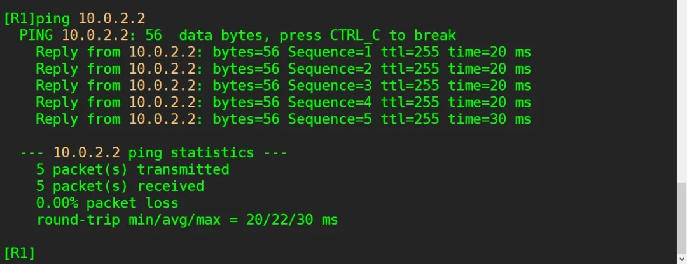

## 实验介绍

### RIP

RIP(Routing Information Protocol，路由协议)作为最早的距离矢量IP 路由协议，也是最先得到广泛使用的一种路由协议，采用了Bellman-Ford算法，其最大的特点就是配置简单。

RIP 协议要求网络中每一台路由器都要维护从自身到每一个目的网络的路由信息。RIP协议使用跳数来衡量网络间的“距离”:从一台路由器到其直连网络的跳数定义为 1，从一台路由器到其非直连网络的距离定义为每经过一个路由器则距离加1。“距离”也称为

允许路

由的最大跳数为15，因此，16即为不可达。可见RIP协议只适用于小型网络。

目前RIP有两个版本，RIPv1和RIPv2，RIPv2针对RIPv1进行扩充，能够携带更多的信息量，并增强了安全性能。RIPv1和RIPv2都是基于UDP的协议，使用UDP520号端口收发数据包。

<!--truncate-->

### 实验目的

- 理解RIP 的应用场景
- 理解RIP 的基本原理
- 掌握RIPv1的基本配置
- 掌握RIPv2 的基本配置
- 掌握测试RIP 路由网络的连通性的方法

### 实验内容

某小型公司组网拓扑很简单，只拥有两台路由器，因此可以采用RIP路由协议来完成网络的部署。

本实验通过模拟简单的企业网络场景来描述RIP路由协议的基本配置，并介绍一些基本的查看RIP信息的命令使用方法。

### 实验拓扑



### 实验编址


## 实验配置

### 基本配置

```
[R1]int g0/0/0
[R1-GigabitEthernet0/0/0]ip add 10.0.12.1 24
[R1]int l 0
[R1-LoopBack0]ip add 10.0.1.1 24

[R2]int g0/0/0
[R2-GigabitEthernet0/0/0]ip add 10.0.12.2 24
[R2]int l 0[R2-LoopBack0]ip add 10.0.2.2 24
```

### 使用RIPV1搭建网络

在公司两台路由器R1和R2 上配置RIP v1。

使用rip 命令创建并开启协议进程，默认情况下进程号是1。

使用network命令对指定网段接口使能RIP功能，注意必须是自然网段的地址。

```
[R1]rip
[R1-rip-1]network 10.0.0.0
[R2]rip
[R2-rip-1]network 10.0.0.0
```

配置完成后，使用display ip routing-table 命令查看R1、R2 的路由表

```
[R1]display ip routing-table
```


可以观察到，两台路由器已经通过RIP协议学习到了对方环回接口所在网段的路由条目。

测试R1与R2环回接口间的连通性。



### 使用RIPV2搭建网络

基于前面的配置，现在只需在RIP子视图模式下配置v2即可。

```
[R1]rip
[R1-rip-1]version 2

[R2]rip
[R2-rip-1]version 2
```

配置完成后使用display ip routing-table 命令查看各路由器路由表。


可以观察到，两台路由器已经通过RIP协议学习到了对方环回接口所在网段的路由条目。

配置完成后，使用ping命令检测R1与R2之间直连链路的IP连通。


## END