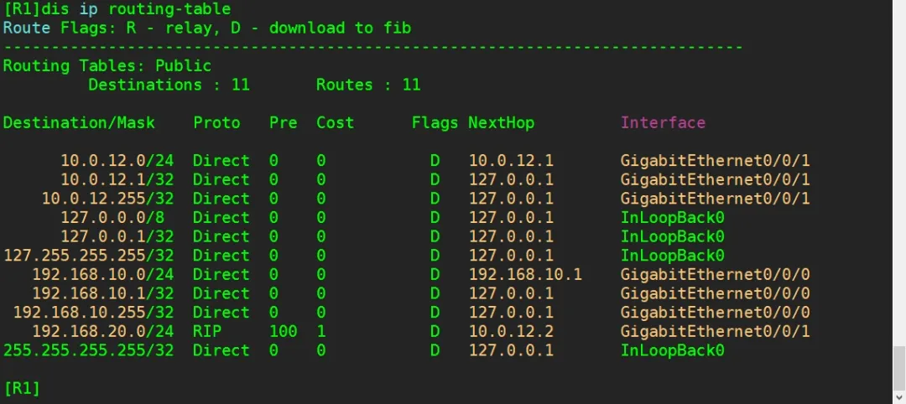

## 实验介绍

### RIP认证

简单验证是一种基于密码的身份验证方法。在RIPV2中，路由器使用预共享的密码对报文进行验证。发送方和接收方都必须知道相同的密码才能通过验证。这种方法对于简单的网络环境来说是足够的，但是密码可能会被截获或破解，所以在更安全的环境中，可以考虑使用MD5密文验证。

MD5密文验证是一种更安全的验证方法。它使用基于MD5算法的散列函数来生成一个固定长度的密文。发送方使用密钥和报文的特定字段计算出一个密文，并将其附加到报文中。接收方使用相同的密钥和相同的字段计算出一个新的密文，并将其与接收到的密文进行比较。如果两者相等，说明报文没有被篡改过。

总之，RIPV2支持简单验证和MD5密文验证两种方法，可以根据网络环境的安全要求选择适合的验证方式。

<!--truncate-->

### 实验目的

- 理解配置RIPv2 认证的场景和意义
- 掌握配置RIPv2 简单验证的方法
- 掌握配置RIPv2 MD5 密文验证的方法

### 实验内容

本实验模拟企业网络场景。某公司有两台路由器R1与R2，各自连接着一台主机，并且R1和R2之间配置RIPv2协议学习路由条目。

R3模拟作为网络中的攻击者，窃取R1与R2间的路由信息，并发布了一些虚假路由，使R1和R2的相关路由的选路指向了R3，形成了路由欺骗。

为了避免遭受攻击，提高网络安全性，网络管理员将配置RIPv2认证。

### 实验拓扑


### 实验编址


## 实验配置

*根据实验编址表进行相应的基本配置，并使用ping命令检测各直连链路的连通性。其中，R3上的两个环回接口先不配置IP地址。*

```

[R1]int g0/0/0
[R1-GigabitEthernet0/0/0]ip add 192.168.10.1/24 
[R1]int g0/0/1
[R1-GigabitEthernet0/0/0]ip add 10.0.12.1/24
[R2]int g0/0/0
[R2-GigabitEthernet0/0/0]ip add 192.168.20.1/24 
[R2]int g0/0/1
[R3-GigabitEthernet0/0/0]ip add 10.0.12.2/24
[R1]int g0/0/0
[R1-GigabitEthernet0/0/0]ip add 10.0.12.3/24 
```

### 搭建RIP网络

配置公司路由器R1和R2的RIPv2协议，并添加需要通告的网段。

```

[R1]rip 1
[R1-rip-1]version 2
[R1-rip-1]network 192.168.10.0
[R1-rip-1]network 10.0.0.0
[R2]rip 1
[R2-rip-1]version 2
[R2-rip-1]network 192.168.20.0
[R2-rip-1]network 10.0.0.0
```

配置完成后，检查R1与R2的路由表。

```
[R1]display ip routing-table
```


### 模拟网络攻击

配置路由器R3 作为攻击者，接入公司网络。

在基本配置中已经将接口GE 0/0/0 地址配置为10.0.12.3，与该公司路由器在同一网段，并配置RIPv2协议，通告该网段，配置完成后查看R3的路由表。

```
[R3]rip 1
[R3-rip-1]version 2
[R3-rip-1]network 10.0.0.0
[R3-rip-1]display ip routing-table
```


观察发现R3已经非法获取了R1和R2上用户终端所在的两个网段的路由信息。此时R3就可以向两个网段发送大量的ping包，导致网络链路拥塞，形成攻击。

下面是 R3 模拟攻击演示，发送 10 万个 ping 包给 PC-1，导致攻击发生。可以按Ctl+C组合键来终止该操作。

```
[R3]ping -c 100000 192.168.10.10
```

完成上述模拟后，在 R3上分别配置两个用于欺骗的环回接口，地址分别为192.168.10.1和192.168.20.1，即与公司网络中两个用户的地址相同，并且在RIP协议中通告这两个欺骗的网段。

```
[R3]interface loopback0
[R3-LoopBack0]ip address 192.168.10.1 255.255.255.0
[R3-LoopBack0]interface loopback1
[R3-LoopBack1]ip address 192.168.20.1 255.255.255.0
[R3-LoopBack1]rip 1
[R3-rip-1]version 2
[R3-rip-1]network 192.168.10.0
[R3-rip-1]network 192.168.20.0
```

配置完成后，查看R1与R2的路由表。

```
[R1]display ip routing-table
```


可以观察到R3发过来的路由更新。因为R2和R3发送RIP更新的cost都是1跳，所以在R1的路由表中，目的为192.168.20.0网段形成了两条等价负载均衡的路径，下一跳分别是R2和R3。

这样会导致去往192.168.20.0网段的数据包有部分转发给了欺骗路由器R3，R2的路由表变化和R1同理。

### 配置RIPV2简单验证

为了提升网络安全性，避免发生上述攻击和路由欺骗，网络管理员可在R1和R2上配置RIP的简单验证实现对网络的保护。在路由器R1和R2 的GE 0/0/1 接口配置认证，使用简单验证方式密码为huawei。

注意，两端的密码必须保持一致，否则会导致认证失败，从而使得 RIP 协议无法正常运行。

```
[R1]interface GigabitEthernet 0/0/1
[R1-GigabitEthernet0/0/1]rip authentication-mode simple huawei

[R2]interface GigabitEthernet0/0/1
[R2- GigabitEthernet0/0/1]rip authentication-mode simple huawei
```

配置完成后，等待一段时间，再次查看R1和R2的路由表。

```
[R1]display ip routing-table
```




可以观察到现在R1与R2的路由表恢复正常，R3发送的欺骗路由在路由表中消失。

原因是R1和R2配置了RIP认证，就要求在RIP更新报文中包含认证密码，如果密码错误或者不存在，将认为该路由非法并丢弃。

### 配置RIPV2 MD5密文验证

在上一步骤中，在R1和R2上配置了简单验证方式的认证后，成功地抵御了R3的路由欺骗和攻击，且主机PC-1与PC-2可以正常通信。

但是通过抓包能够发现，简单验证方式下的认证安全性非常差，攻击者虽然无法直接攻击网络，但是可以通过抓取 RIP协议数据包获得明文密码，因此建议使用MD5密文验证方式进行RIPv2的认证。

在R1和R2的GE 0/0/1接口上删除上一步骤中的简单验证配置，选择使用MD5 密文验证方式配置。配置时可以选择MD5密文验证方式的报文格式，usual参数表示使用通用报文格式;

nonstandard参数表示使用非标准报文格式(IETF标准)，但是必须保证两端的报文格式一致，这里选用通用标准格式。

```
[R1-GigabitEthernet0/0/1]undo rip authentication-mode

[R1-GigabitEthernet0/0/1]rip authentication-mode md5 usual huawei

[R2-GigabitEthernet0/0/1]undo rip authentication-mode

[R2-GigabitEthernet0/0/1]rip authentication-mode md5 usual huawei
```

配置完成后，查看R1和R2路由表。

```
[R1]display ip routing-table
```


