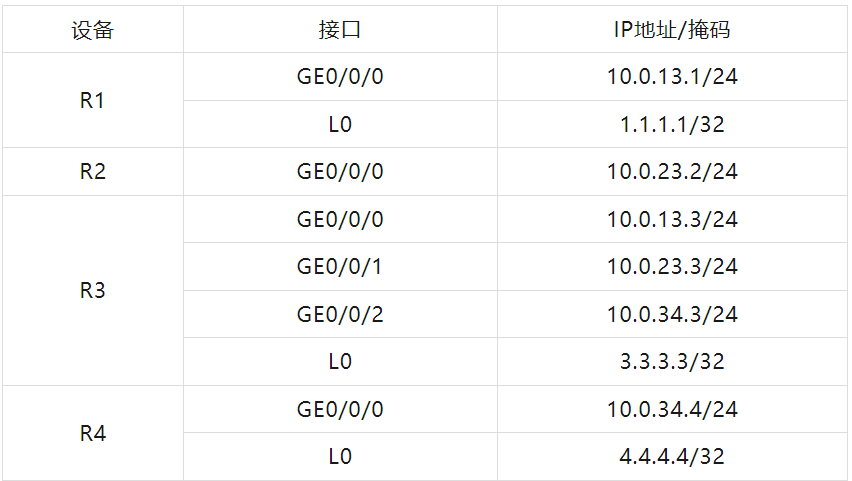
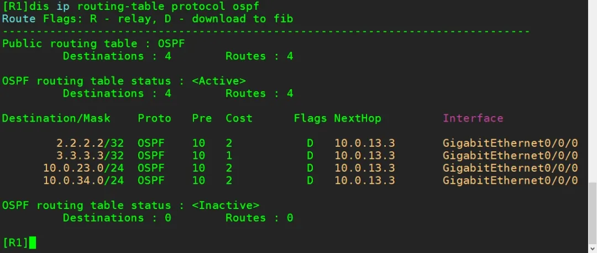
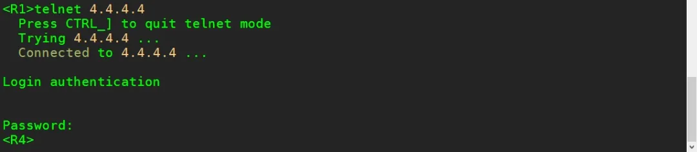
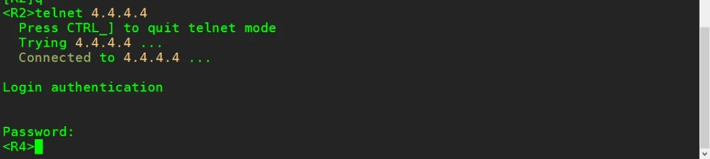
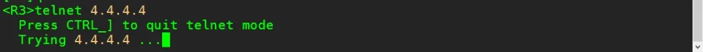

## 实验介绍

**ACL**

访问控制列表ACL(Access ControlList)是由permit 或deny语句组成的一系列有顺序的规则集合，这些规则根据数据包的源地址、目的地址、源端口、目的端口等信息来描述。ACL规则通过匹配报文中的信息对数据包进行分类，路由设备根据这些规则判断哪些数据包可以通过，哪些数据包需要拒绝。

按照访问控制列表的用途，可以分为基本的访问控制列表和高级的访问控制列表，基本ACL可使用报文的源IP地址、时间段信息来定义规则，编号范围为2000~2999。

一个ACL可以由多条“deny/permit”语句组成，每一条语句描述一条规则，每条规则有一个Rule-ID。Rule-D可以由用户进行配置，也可以由系统自动根据步长生成，默认步长为5，Rule-ID默认按照配置先后顺序分配0、5、10、15等，匹配顺序按照ACL的Rule-ID的顺序，从小到大进行匹配。

<!--truncate-->

### 实验目的

- 理解基本访问控制列表的应用场景
- 掌握配置基本访问控制列表的方法

### 实验内容

本实验模拟企业网络环境，R1为分支机构A管理员所在IT部门的网关，R2为分支机构A用户部门的网关，R3为分支机构A去往总部出口的网关设备，R4为总部核心路由器设备。整网运行OSPF协议，并在区域0内。

企业设计通过远程方式管理核心网路由器R4，要求只能由R1所连的PC(本实验使用环回接口模拟)访问R4，其他设备均不能访问。

### 实验拓扑


### 实验编址



## 实验配置

### 基本配置

```
[R1]int g0/0/0
[R1-GigabitEthernet0/0/0]ip add 10.0.13.1 24
[R1]int l0
[R1-loopback0]ip add 1.1.1.1 32

[R2]int g0/0/0
[R2-GigabitEthernet0/0/0]ip add 10.0.23.2 24

[R3]int g0/0/0
[R3-GigabitEthernet0/0/0]ip add 10.0.13.3 24
[R3]int g0/0/1
[R3-GigabitEthernet0/0/1]ip add 10.0.23.3 24
[R3]int g0/0/2
[R3-GigabitEthernet0/0/2]ip add 10.0.34.3 24
[R3]int l0
[R3-loopback0]ip add 3.3.3.3 32

[R4]int g0/0/0
[R4-GigabitEthernet0/0/0]ip add 10.0.34.4 24
[R4]int l0
[R4-loopback0]ip add 4.4.4.4 32
```

### 部署OSPF网络

配置OSPF协议，使用进程号1，且所有网段均通告进区域0中。

```
[R1]ospf 1
[R1-ospf-1]area 0
[R1-ospf-1-area-0.0.0.0]network 10.0.13.0 0.0.0.255
[R1-ospf-1-area-0.0.0.0]network 1.1.1.1 0.0.0.0

[R2]ospf 1
[R2-ospf-1]area 0
[R2-ospf-1-area-0.0.0.0]network 10.0.23.0 0.0.0.255

[R3]ospf 1
[R3-ospf-1]area 0
[R3-ospf-1-area-0.0.0.0]network 10.0.13.0 0.0.0.255
[R3-ospf-1-area-0.0.0.0]network 10.0.23.0 0.0.0.255
[R3-ospf-1-area-0.0.0.0]network 10.0.34.0 0.0.0.255
[R3-ospf-1-area-0.0.0.0]network 3.3.3.3 0.0.0.0

[R4]ospf 1
[R4-ospf-1]area 0
[R4-ospf-1-area-0.0.0.0]network 10.0.34.0 0.0.0.255
[R4-ospf-1-area-0.0.0.0]network 4.4.4.4 0.0.0.0
```

配置完成之后，在R1的路由表上查看OSPF路由信息。

```
<R1>display ip routing-table protocol ospf
```



### 配置基本ACL控制访问

在总部核心路由器R4上配置Telnet相关配置，配置用户密码为huawei

```
[R4]user-interface vty 0 4
[R4-ui-vty0-4]authentication-mode passwordPlease configure the login password (maximum length 16):huawei
```

配置完成后，尝试在IT部门网关设备R1上建立Telnet连接。

```
<R1>telnet 4.4.4.4
```



可以观察到，R1可以成功登录R4。再尝试在普通员工部门网关设备R2上建立连接。

```
<R2>telnet 4.4.4.4
```



这时发现，只要是路由可达的设备，并且拥有Telnet的密码，都可以成功访问核心设备R4。这显然是极为不安全的。网络管理员通过配置标准ACL来实现访问过滤，禁止普通员工设备登录。

基本的ACL可以针对数据包的源IP地址进行过滤，在R4上使用acl命令创建一个编号型ACL，基本ACL的范围是2000~2999。

```
[R4]acl 2000
```

接下来在ACL视图中，使用rule命令配置ACL规则，指定规则ID为允许数据包源地址为1.1.1.1的报文通过，反掩码为全0，即精确匹

```
[R4-acl-basic-2000]rule 5 permit source 1.1.1.1 0
```

使用mule命令配置第二条规则，指定规则ID为10，拒绝任意源地址的数据包通过。

```
[R4-acl-basic-2000]rule 10 deny source any
```

在上面的ACL配置中，第一条规则的规则ID定义为5，并不是1;第二条定义为 10，也不与5连续，这样配置的好处是能够方便后续的修改或插入新的条目。并且在配置的时候也可以不采用手工方式指定规则ID，ACL会自动分配规则ID，第一条为5，第二条为10，第三条为15，依此类推，即默认步长为5，该步长参数也是可以修改的。

ACL配置完成后，在 VTY中调用。使用inbound参数，即在 R4的数据入方向上调用。

```
[R4]user-interface vty 0 4
[R4-ui-vty0-4]acl 2000 inbound
```

配置完成后，使用R1的环回口地址1.1.1.1测试访问4.4.4.4的连通

```
<R1>telnet -a 1.1.1.1 4.4.4.4
```


发现没有问题，然后尝试在R2上访问R4。

```
<R2>telnet 4.4.4.4
```

可以观察到，此时R2已经无法访问4.4.4.4，即上述ACL配置已经生效。


### 基本ACL语法规则

ACL的执行是有顺序性的，如果规则ID小的规则已经被命中，并且执行了允许或者拒绝的动作，那么后续的规则就不再继续匹配。

在R4 上使用display acl all 命令查看设备上所有的访问控制列表。

```
[R4]display acl all
```


以上是目前 ACL 的所有配置信息。根据上一步骤中的配置，R4中存在一个基本ACL，有两个规则rule5permit source 1.1.1.10和rule 10deny source any，且根据这两个规则已经将R2的访问拒绝。现出现新的需求，需要R3能够使用其环回口3.3.3.3访问R4。

首先尝试使用规则ID 15 来添加允许3.3.3.3 访问的规则。

```
[R4]acl 2000
[R4-acl-basic-2000]rule 15 permit source 3.3.3.3 0
```

配置完成后，尝试使用R3的3.3.3.3访问R4。

```
<R3>telnet -a 3.3.3.3 4.4.4.4
```


发现无法访问。按照ACL匹配顺序，这是由于规则为10的条目是拒绝所有行为，后续所有的允许规则都不会被匹配。若要此规则生效，必须添加在拒绝所有的规则 ID之前。

在R4上修改ACL 2000，将规则ID 修改为8。

```
[R4]acl 2000
[R4-acl-basic-2000]undo rule 15
[R4-acl-basic-2000]rule 8 permit source 3.3.3.3 0
```

配置完成后，再次尝试使用R3的环回口访问R4。

```
<R3>telnet -a 3.3.3.3 4.4.4.4
```



此时访问成功，证明配置已经生效。

## END.