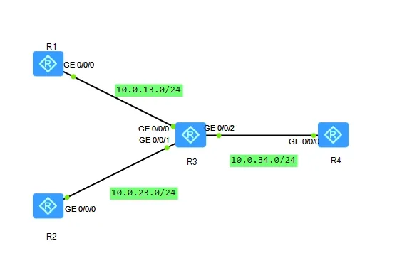
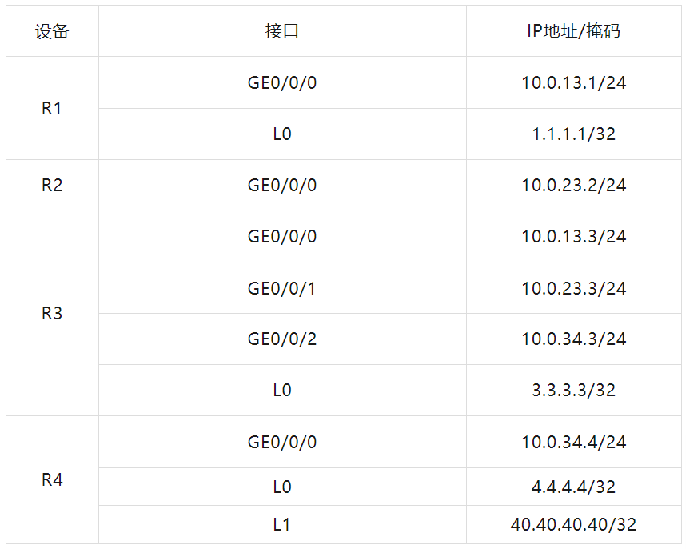
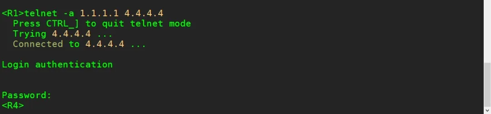
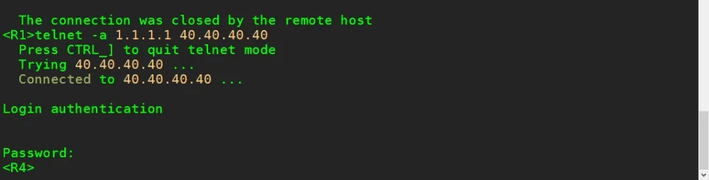
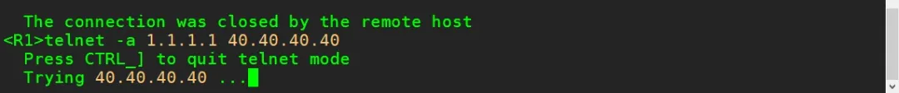

## 实验介绍

 **高级ACL**

基本的ACL只能用于匹配源IP地址，而在实际应用当中往往需要针对数据包的其他参数进行匹配，比如目的I地址、协议号、端口号等，所以基本的ACL由于匹配的局限性而无法实现更多的功能，所以就需要使用高级的访问控制列表。

高级的访问控制列表在匹配项上做了扩展，编号范围为3000~3999，既可使用报文的源IP地址，也可使用目的地址、IP优先级、IP协议类型、ICMP类型、TCP源端口/目的端口、UDP源端口/目的端口号等信息来定义规则。

高级访问控制列表可以定义比基本访问控制列表更准确、更丰富、更灵活的规则，也因此得到更加广泛的应用。

<!--truncate-->

### 实验目的

- 理解高级访问控制列表的应用场景
- 掌握配置高级访问控制列表的方法
- 理解高级访问控制列表与基本访问控制列表的区别

### 实验内容

本实验模拟企业网络环境。R1为分支机构A管理员所在IT部门的网关，R2为分支机构A用户部门的网关，R3为分支机构A去往总部出口的网关设备，R4为总部核心路由器设备。

企业原始设计思路想要通过远程方式管理核心网路由器R4，要求由R1所连的PC可以访问R4，其他设备均不能访问。

同时又要求只能管理R4上的4.4.4.4这台服务器，另一台同样直连R4的服务器40.40.40.40不能被管理(本实验PC使用环回接口模拟)。

### 实验拓扑



### 实验编址



## 实验配置

### 基本配置

```
[R1]int g0/0/0
[R1-GigabitEthernet0/0/0]ip add 10.0.13.1 24
[R1]int l0
[R1-loopback0]ip add 1.1.1.1 32

[R2]int g0/0/0
[R2-GigabitEthernet0/0/0]ip add 10.0.23.2 24

[R3]int g0/0/0
[R3-GigabitEthernet0/0/0]ip add 10.0.13.3 24
[R3]int g0/0/1
[R3-GigabitEthernet0/0/1]ip add 10.0.23.3 24
[R3]int g0/0/2
[R3-GigabitEthernet0/0/2]ip add 10.0.34.3 24
[R3]int l0
[R3-loopback0]ip add 3.3.3.3 32

[R4]int g0/0/0
[R4-GigabitEthernet0/0/0]ip add 10.0.34.4 24
[R4]int l0
[R4-loopback0]ip add 4.4.4.4 32
[R4]int l1
[R4-loopback0]ip add 40.40.40.40 32
```

### 部署OSPF网络

配置OSPF协议，使用进程号1，且所有网段均通告进区域0中。

```
[R1]ospf 1
[R1-ospf-1]area 0
[R1-ospf-1-area-0.0.0.0]network 10.0.13.0 0.0.0.255
[R1-ospf-1-area-0.0.0.0]network 1.1.1.1 0.0.0.0

[R2]ospf 1
[R2-ospf-1]area 0
[R2-ospf-1-area-0.0.0.0]network 10.0.23.0 0.0.0.255

[R3]ospf 1
[R3-ospf-1]area 0
[R3-ospf-1-area-0.0.0.0]network 10.0.13.0 0.0.0.255
[R3-ospf-1-area-0.0.0.0]network 10.0.23.0 0.0.0.255
[R3-ospf-1-area-0.0.0.0]network 10.0.34.0 0.0.0.255
[R3-ospf-1-area-0.0.0.0]network 3.3.3.3 0.0.0.0

[R4]ospf 1
[R4-ospf-1]area 0
[R4-ospf-1-area-0.0.0.0]network 10.0.34.0 0.0.0.255
[R4-ospf-1-area-0.0.0.0]network 4.4.4.4 0.0.0.0
[R4-ospf-1-area-0.0.0.0]network 40.40.40.40 0.0.0.0
```

配置完成之后，在R1的路由表上查看OSPF路由信息。

```
<R1>display ip routing-table protocol ospf
```


### 配置Telnet

在总部核心路由器R4上配置Telnet相关配置，配置用户密码huawei

```
[R4]user-interface vty 0 4
[R4-ui-vty0-4]authentication-mode passwordPlease configure the login password (maximum length 16):huawei
```

配置完成后，尝试在R1上建立与R4的环回接口0的IP地址的Telr连接。

```
<R1>telnet -a 1.1.1.1 4.4.4.4
```

可以观察到，R1已经可以成功登录R4。再尝试在R1上建立与R4的环回接口1的IP地址的Telnet连接。

```
<R1>telnet -a 1.1.1.1 40.40.40.40
```





这时发现，只要是路由可达的设备，并且拥有Telnet的密码，都以成功正常登录。

### 配置高级ACL控制访问

根据设计要求，R1的环回接口只能通过R4上的4.4.4.4进行Telnet问，但是不能通过40.40.40.40访问。

如果要R1只能通过访问R4的环回口0地址登录设备，即同时匹配据包的源地址和目的地址实现过滤，此时通过标准ACL是无法实的，因为ACL只能通过匹配源地址实现过滤，所以需要使用到高ACL。

在R4 上使用acl命令创建一个高级ACL 3000。

```
[R4]acl 3000
```

在高级ACL视图中，使用rule命令配置ACL规则，ip为协议类型允许源地址为1.1.1.1、目的地址为4.4.4.4的数据包通过。

```
[R4-acl-adv-3000]rule permit ip source 1.1.1.1 0 destination 4.4.4.4 0
```

配置完成后，查看ACL配置信息。

```
[R1-acl-adv-3000]dis acl all
```

可以观察到，在不指定规则ID的情况下，默认步长为5，第一条则的规则ID即为5。将ACL 3000 调用在VTY 下，使用inbound 参数，即在R4的数据方向上调用。

```
[R4]user-interface vty 0 4[R4-ui-vty0-4]acl 3000 inbound
```

配置完成后，在R1上使用环回口地址尝试访问40.40.40.40。

```
<R1>telnet -a 1.1.1.1 40.40.40.40
```



可以观察到，此时过滤已经实现，R1不能使用环回口地址访40.40.40.40。此外高级ACL还可以实现对源、目的端口，协议号等信息的配，功能非常强大。

## END.