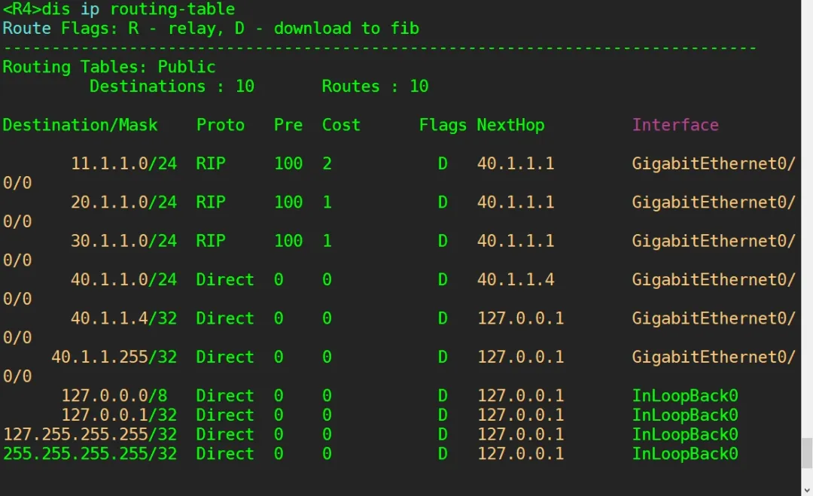
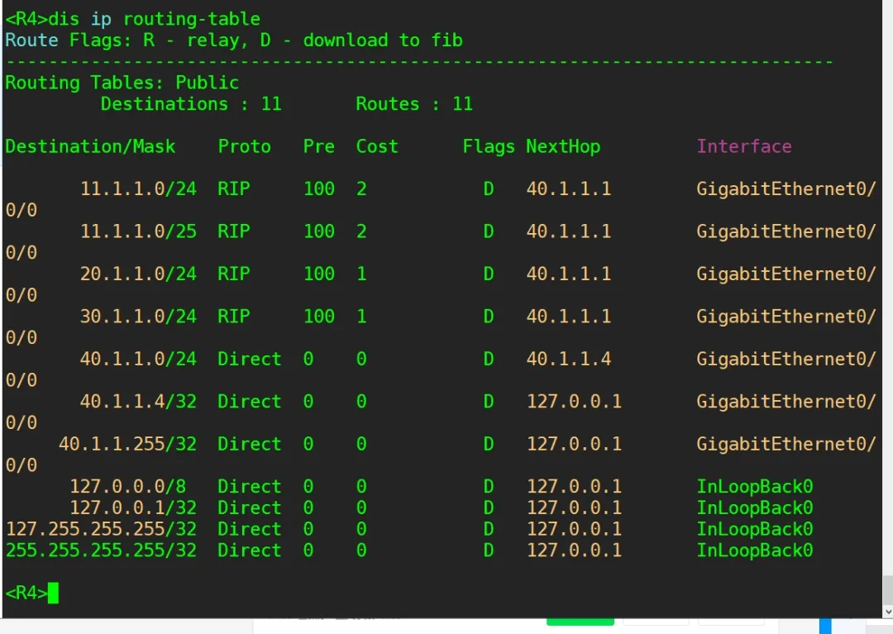
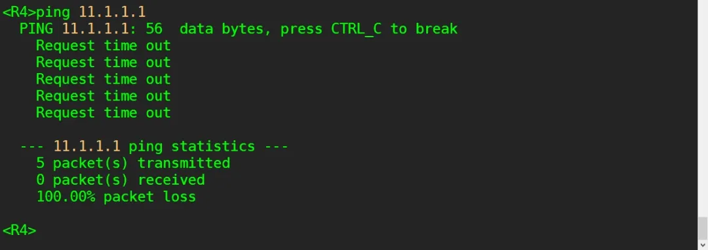
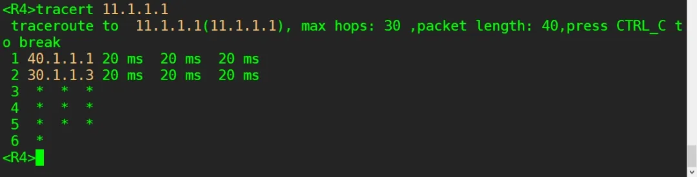
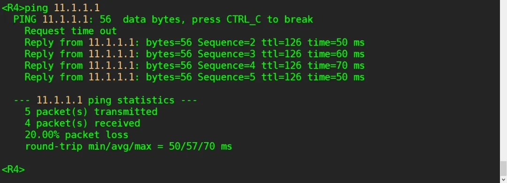

## 实验介绍

**前缀列表**

前缀列表即 IP-Prefix List，它可以将与所定义的前缀列表相匹配的路由，根据定义的匹配模式进行过滤。前缀列表中的匹配条目由IP 地址和掩码组成，IP 地址可以是网段地址或者主机地址，掩码长度的配置范围为 0~32，可以进行精确匹配或者在一定掩码长度范围内匹配

也可以通过配置关键字greater-equal和less-equal指定待匹配的前缀掩码长度范围。

前缀列表能同时匹配前缀号和前缀长度，主要用于路由的匹配和控制，不能用于数据包的过滤。

<!--truncate-->

### 实验目的

- 理解前缀列表的应用场景
- 掌握前缀列表的配置方法
- 理解前缀列表与ACL 的区别

### 实验内容

本实验模拟公司网络场景。公司分部A网络使用11.1.1.0/24网段，通过路由器R2和骨干路由器R1相连，网络运行RIPv2协议。现在公司新成立一个分部B，新分部B的路由器R3连接R1加入该RIPv2网络。

由于新分部B的网络管理员不熟悉公司内网IP地址规划，在新分部B中使用了11.1.1.0/25网段，这样导致从总部发往分部A的部分数据包在R1上都会由于路由掩码最长匹配从而错误地发往分部B。

而整个新分部B整改 IP 地址需要一定时间，公司当务之急是需要恢复总部与分部 A的通信，可以通过在R1上使用前缀列表过滤掉这些错误的路由。

### 实验拓扑


### 实验编址


## 实验配置

### 基本配置

```
[R1]int g0/0/0
[R1-GigabitEthernet0/0/0]ip add 40.1.1.1 24
[R1]int g0/0/1
[R1-GigabitEthernet0/0/1]ip add 20.1.1.1 24
[R1]int g0/0/2
[R1-GigabitEthernet0/0/2]ip add 30.1.1.1 24

[R2]int g0/0/0
[R2-GigabitEthernet0/0/0]ip add 11.1.1.2 24
[R2]int g0/0/1
[R2-GigabitEthernet0/0/1]ip add 20.1.1.2 24

[R3]int g0/0/0
[R3-GigabitEthernet0/0/0]ip add 11.1.1.11 25
[R3]int g0/0/1
[R3-GigabitEthernet0/0/1]ip add 30.1.1.3 24

[R4]int g0/0/0
[R4-GigabitEthernet0/0/0]ip add 40.1.1.4 24
```

### 部署RIP网络

公司内部网络使用RIPv2协议。首先配置R1、R2和R4运行RIPv2协在总部路由器R4上能访问分部A的PC。

```

[R1]rip 1
[R1-rip-1]version 2
[R1-rip-1]undo summary
[R1-rip-1]network 20.0.0.0
[R1-rip-1]network 30.0.0.0
[R1-rip-1]network 40.0.0.0

[R2]rip 1
[R2-rip-1]version 2
[R2-rip-1]undo summary
[R2-rip-1]network 11.0.0.0
[R2-rip-1]network 20.0.0.0

[R4]rip 1
[R4-rip-1]version 2
[R4-rip-1]undo summary
[R4-rip-1]network 40.0.0.0
```

配置完成后，查看总部R4的路由表

```
[R4]display ip routing-table
```



可以观察到，R4的路由表中已经获得了11.1.1.0/24的路由，测试R4与公司总部A中PC-1间的连通性。

```
[R4]ping 11.1.1.1
```


现在新分部B加入公司网络，在R3上配置RIPv2协议。

```
[R3]rip 1[R3-rip-1]version 2[R3-rip-1]undo summary[R3-rip-1]network 11.0.0.0[R3-rip-1]network 30.0.0.0
```

配置完成后，再一次查看R4的路由表。

```
[R4]display ip routing-table
```



可以观察到，此时 R4接收到了公司分部 A的 11.1.1.0/24路由条目和新分部B的 11.1.1.0/25路由条目，同样 R1也会接收到这两条路由条目，这样会造成什么后果?

根据路由器转发数据的原理，在转发数据包时路由器会根据最长匹配的原则去匹配路由条目，即R4向分部A的终端PC-1发送数据时，当数据包到达R1后，根据包头的目的IP地址与路由表中的路由条目进行匹配，发现11.1.1.0/25条目匹配更精确，这会使得数据包都根据这条

路由条目进行转发，即将原本要发往 PC-1的数据包都错误地发往R3，造成总部与分部A异常通信。

在R4上测试与PC-1间的连通性。

```
<R4>ping 11.1.1.1
```



可以观察到此时无法正常通信。在R4上使用tracert命令测试发往PC-1的数据包所经过的网关。

```
<R4>tracert 11.1.1.1
```



可以观察到，此时R4发往分公司A的PC-1的数据包确实都已错误地发往R3。

### 配置ACL过滤路由

由于业务需要，现公司急需恢复总部与分部A间的通信。但是重新规划并配置整个分部B的IP地址需要一定时间，此时网络管理员尝试使用ACL来配置路由过滤，即在R1上过滤掉11.1.1.0/25这条路由。

在R1 上创建基本的ACL，拒绝11.1.1.0 这个目的网段的路由。


```
[R1]acl number 2000
[R1-acl-basic-2000]rule 5 deny source 11.1.1.0 0.0.0.0
[R1-acl-basic-2000]rule 10 permit source any
```

接下来在RIP视图下，配置过滤策略(filter-policy)，该策略通过调用之前配置好的ACL来达到过滤路由的目的，并且在R1的RIP路由进程中的接收方向应用此路由过滤策略。


观察发现R1的路由表中11.1.1.0/24和11.1.1.0/25这两条路由都被过滤。这是因为ACL无法实现对掩码长度进行精确匹配，而分部A的网络位和分部B的网络位相同，都是11.1.1.0，就会导致把分部A的路由也同时过滤。

### 配置前缀列表过滤路由

为了能够精确匹配掩码长度，仅过滤掉 11.1.1.0/25 这条新分部 B的路由，可以在R1上配置前缀列表。在R1上配置前缀列表，同时精确匹配网络位和掩码长度。

```
[R1]ip ip-prefix 1 deny 11.1.1.0 25 greater-equal 25 less-equal 25
[R1]ip ip-prefix 1 permit 0.0.0.0 0 less-equal 32
```

第二条配置表示放行所有其他的路由，这是因为前缀列表也会有一条隐含的拒绝所有的规则，所以如果要放行其他所有路由的话，一定要显式增加一条允许所有的规则。而第一条配置也可以使用下面的方式简写。

```
[R1]ip ip-prefix 1 deny 11.1.1.0 25
```

将该前缀列表应用到过滤策略下

```
[R1-rip-1]filter-policy ip-prefix 1 import
```

配置完成后，查看R1的路由表。

```
<R1>display ip routing-table
```


可以观察到，此时R1的路由表中仅存在11.1.1.0/24，即分部A的路由条目，这样就恢复了总部与分部A的通信。测试总部与分部A中PC-1间的连通性。

```
<R4>ping 11.1.1.1
```



### 恢复新分部网络

为了新分部B能正确接入现有网络中，网络管理员需要重新规划IP地址，使分部B能与公司总部及分部A通信。

规划分部B网络使用11.2.2.0/24网段，更改PC-2的IP地址为11.2.2.1/24，R3的GE0/0/0接口IP地址为11.2.2.3/24。

```
[R3]interface GigabitEthernet 0/0/0
[R3-GigabitEthernet0/0/0]ip address 11.2.2.3 24
```

配置完成后，查看R1的路由表。

```
<R1>display ip routing-table
```


可以观察到，R1的路由表中现有新分部B所在10.2.2.0/24网段的路由条目，也有分部A的路由。使用ping命令测试总部与分部A、新分部B间的连通性。

```
<R4>ping 11.1.1.1
<R4>ping 11.2.2.1
```


## END.