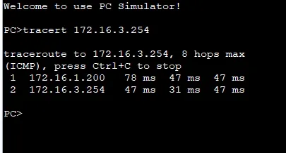
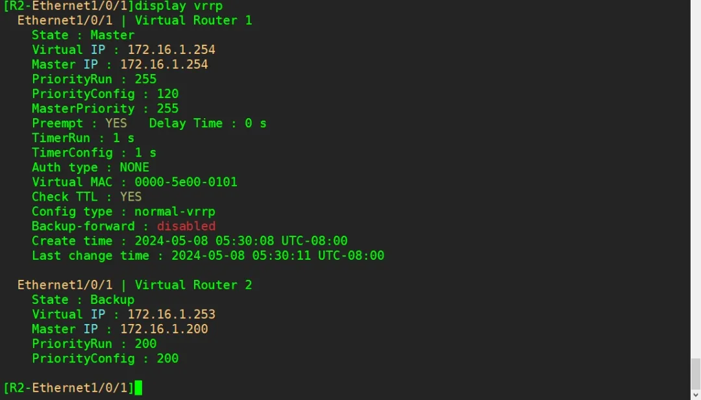

## 实验介绍

### VRRP

当VRRP配置为单备份组时，业务全部由Master设备承担，而Backup设备完全处于空闲状态，没有得到充分利用。VRRP可以通过配置多备份组来实现负载分担，有效地解决了这一问题。

VRRP允许同一台设备的同一个接口加入多个VRRP备份组，在不同备份组中有不同的优先级，使得各备份组中的Master设备不同，也就是建立多个虚拟网关路由器。各主机可以使用不同的虚拟组路由器作为网关出口，这样可以达到分担数据流而又相互备份的目的，充分利用了每一台设备的资源。

VRRP的优先级取值范围中，255是保留给IP地址拥有者使用的，当一个VRRP路由器的物理端口IP地址和虚拟路由器的虚拟IP地址相同，这台路由器称为虚拟IP地址拥有者，VRRP优先级自动设置为255;优先级0也是特殊值，当Master设备删除VRRP配置停止运行VRRP时，会发送优先级为0的VRRP报文通知Backup设备，当Backup收到该消息后，立刻从Backup状态转为Master状态。

<!--truncate-->

### 实验目的

- 理解VRRP多备份组的应用场景
- 掌握VRRP多备份组的配置方法
- 理解VRRP的运行优先级和配置优先级
- 理解VRRP虚拟地址拥有者的应用

### 实验内容

本实验模拟企业网络场景。该公司使用两台路由器R2和R3作为出口网关连接到外网R1，R2和R3运行VRRP协议，两台路由器在同一个虚拟组。当R2为主路由器时，所有业务流量都由R2承担，高峰期时会造成网络阻塞，而R3一直处于空闲状态，这样就造成了一台路由器资源的浪费。现在为了优化公司网络，增加设备利用率，需要在R2和R3之间部署双备份组VRRP，使得R2、R3分别为两个备份组的Master，保证设备的利用率。

### 实验拓扑


### 实验编址


##  实验配置

### 基本配置

```

[R1]int g0/0/0
[R1-GigabitEthernet0/0/0]ip add 172.16.2.254 24
[R1]int g0/0/1
[R1-GigabitEthernet0/0/1]ip add 172.16.3.254 24

[R2]int e1/0/1
[R2-Ethernet1/0/1]ip add 172.16.1.100 24
[R2]int g0/0/0
[R2-GigabitEthernet0/0/0]ip add 172.16.2.100 24

[R3]int e1/0/1
[R3-Ethernet1/0/0]ip add 172.16.1.200 24
[R3]int g0/0/1
[R3-GigabitEthernet0/0/1]ip add 172.16.3.200 24
```

### 部署OSPF网络

在公司的出口网关路由器R1、R2和外网路由器R3上配置OSPF协议，使用进程号1，且所有网段均通告进区域0中。

```
[R1]ospf 1
[R1-ospf-1]area 0
[R1-ospf-1-area-0.0.0.0]network 172.16.2.0 0.0.0.255
[R1-ospf-1-area-0.0.0.0]network 172.16.3.0 0.0.0.255

[R2]ospf 1
[R2-ospf-1]area 0
[R2-ospf-1-area-0.0.0.0]network 172.16.1.0 0.0.0.255
[R2-ospf-1-area-0.0.0.0]network 172.16.2.0 0.0.0.255

[R3]ospf 1
[R3-ospf-1]area 0
[R3-ospf-1-area-0.0.0.0]network 172.16.1.0 0.0.0.255
[R3-ospf-1-area-0.0.0.0]network 172.16.3.0 0.0.0.255
```

配置完成后，在R1上检查OSPF邻居建立情况。

```
[R1]display ospf peer brief
```


### 配置VRRP双备份

 为了提高网络的可靠性，公司采用双出口的形式连接到外网。但是如果采用普通的VRRP 单备份组配置，就会有一台设备处在空闲状态。

为了提高设备的利用率，网络管理员决定采用双备份组的配置，使得不同的设备成为不同备份组中的Master，一起承担网络流量。

在R2和R3上创建VRRP虚拟组1，虚拟IP为172.16.1.254，指定R2的优先级为120，R3的优先级保持默认优先级不变。

```
[R2]interface Ethernet 1/0/1
[R2-Ethernet1/0/1]vrrp vrid 1 virtual-ip 172.16.1.254
[R2-Ethernet1/0/1]vrrp vrid 1 priority 120

[R3]interface Ethernet 1/0/1
[R3-Ethernet1/0/1]vrrp vrid 1 virtual-ip 172.16.1.254
```

配置完成后，分别查看R2和R3的VRRP信息。

```
[R2]display vrrp brief
```


可以观察到，R2为组1的Master，R3为Backup。在R2和R3上创建VRRP虚拟组2，虚拟IP为172.16.1.253，指定R3的优先级为120，R2的优先级保持默认优先级不变。

```
[R2]interface Ethernet 1/0/1
[R2-Ethernet1/0/1]vrrp vrid 2 virtual-ip 172.16.1.253
[R3]interface Ethernet 1/0/1

[R3-Ethernet1/0/1]vrrp vrid 2 virtual-ip 172.16.1.253
[R3-Ethernet1/0/1]vrrp vrid 2 priority 120
```

配置完成后，分别查看R2和R3的VRRP信息。

```
[R2]display vrrp brief
```


可以观察到，R3为组2的Master，R2为Backup。

在PC-1上设置网关地址为172.16.1.254，PC-2上设置网关地址为172.16.1.253，并在PC-1上执行tracert 172.16.2.254命令，PC-2 上执行tracert 172.16.3.254 命令。




观察发现PC-1现在是通过R2访问外网，PC-2现在是通过R3访问外网，实现了网络优化的需求。

### 配置VRRP双备份

在虚拟组2中R3为Master路由器，优先级为120。现在虚拟组2中修改R2的抢占模式为非抢占方式(默认是抢占方式)，并将优先级改为200，即大于R3的优先级。

```
[R2]interface Ethernet 1/0/1
[R2-Ethernet1/0/1]vrrp vrid 2 preempt-mode disable
[R2-Ethernet1/0/1]vrrp vrid 2 priority 200
```

配置完成后，在R2上查看虚拟组2的信息。

```
[R2-Ethernet1/0/1]display vrrp
```


可以观察到，尽管R2的配置优先级大于R3，并且最终运行优先级也大于R3，但是由于R2是非抢占模式，R2不会抢占成为Master。

### 配置虚拟IP拥有者

在虚拟组1中，R2的配置优先级为120，R3的配置优先级为默认的100，R2暂时是虚拟组1的Master路由器。现在网络管理员为了保证R2在虚拟组1始终是Master，在R2的E1/0/1接口上修改IP地址为172.16.1.254/24，这样R2就成为了该虚拟组的虚拟IP地址拥有者。

```
[R2]interface Ethernet 1/0/1
[R2-Ethernet1/0/1]ip address 172.16.1.254 24
```

配置完成后，更改R3在虚拟组1的配置优先级为可配的最大值254，这样R3的配置优先级就大于现在R2的配置优先级。

```
[R3]interface Ethernet 1/0/1
[R3-Ethernet1/0/1]vrrp vrid 1 priority 254
```

配置完成后，使用display vrrp brief命令查看主备状态。

```
[R3]display vrrp brief
```


观察发现R3无法抢占成为虚拟组1的Master。查看R2上的VRRP信息。

```
[R2]display vrrp
```



可以观察到，虽然R2在虚拟组1的配置优先级为120，但是在成为了虚拟IP地址拥有者之后，其运行优先级为255，高于R3的优先级254，所以R3无法抢占成为该组的Master。这再次验证了Master的选举及抢占都是比较运行优先级。

## END.